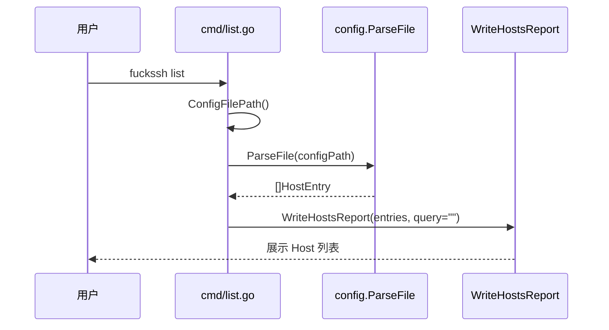
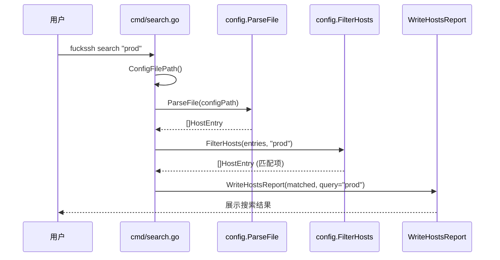
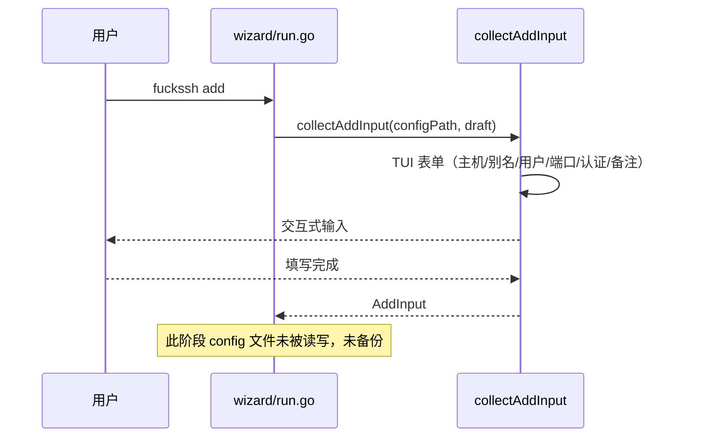
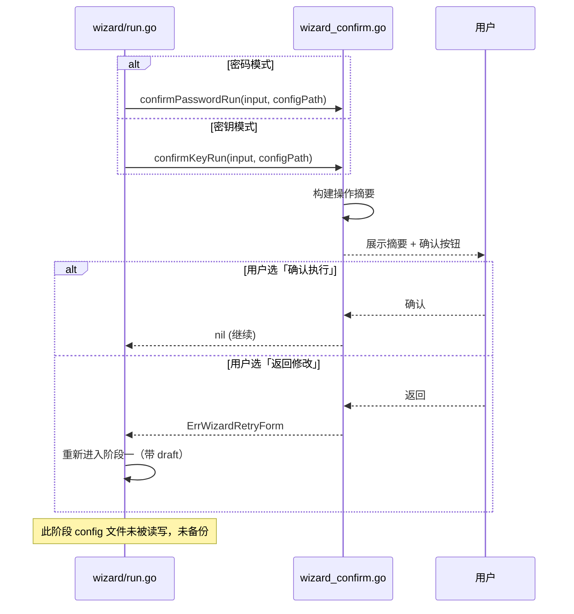
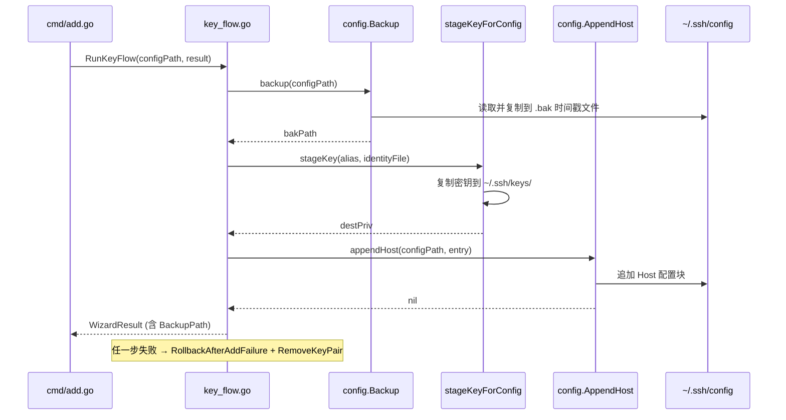
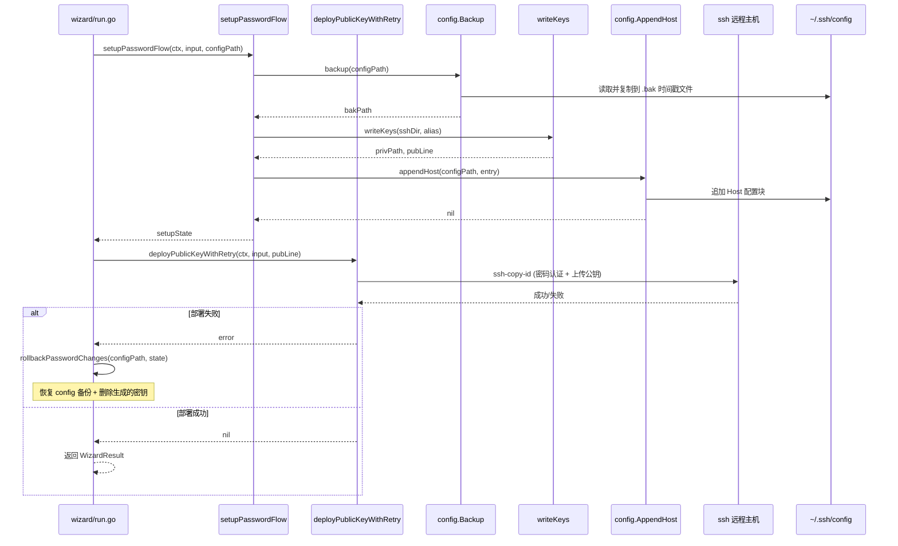

# 命令执行时序图

三条核心命令的执行流程，用 Mermaid 时序图描述。

---

## 1. `fuckssh list` — 列出所有 Host

**特点**：只读操作，不修改任何文件。

---

## 2. `fuckssh search <query>` — 搜索 Host

**特点**：只读操作，在 list 基础上增加过滤。

---

## 3. `fuckssh add` — 添加 VPS Host

`add` 分为三个阶段：

### 阶段一：填写表单

### 阶段二：确认执行

### 阶段三：执行写盘

#### 密钥模式（Key Mode）

#### 密码模式（Password Mode）

---

## 设计要点

| 要点 | 说明 |
|---|---|
| **阶段隔离** | 表单收集、确认、执行三个阶段严格分离；前两个阶段是纯内存操作 |
| **写前备份** | config 文件只在阶段三被修改，备份也在阶段三才发生 |
| **失败回滚** | 任一步失败都回滚：恢复 config 备份 + 删除已生成的密钥 |
| **依赖注入** | backup/stageKey/appendHost 等均可注入，便于单测验证调用顺序 |
