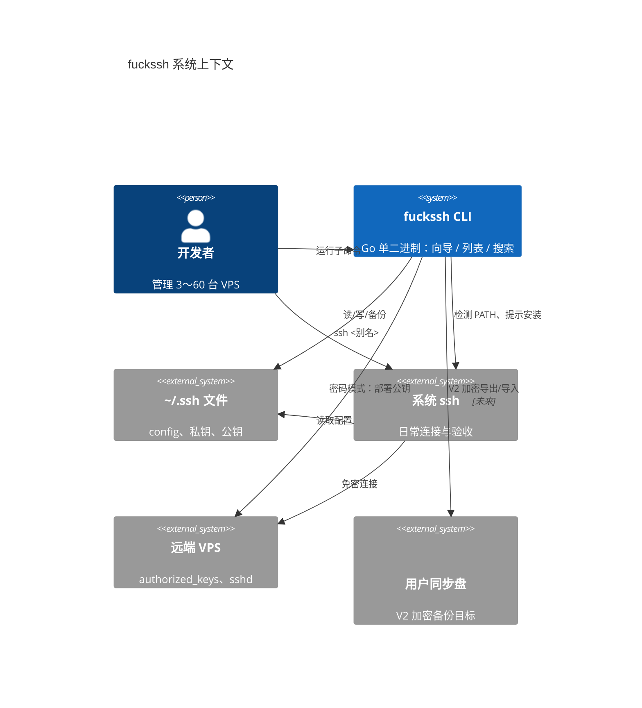
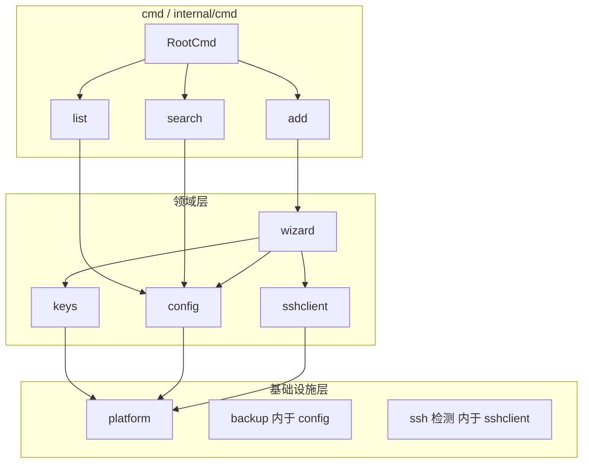
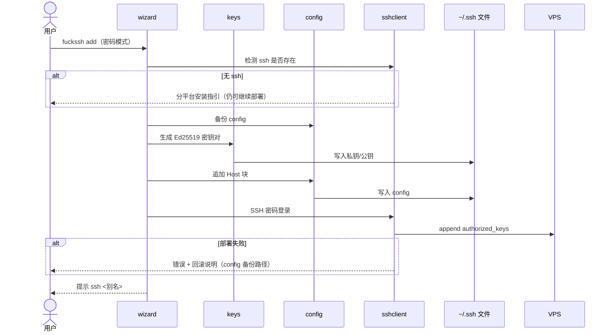
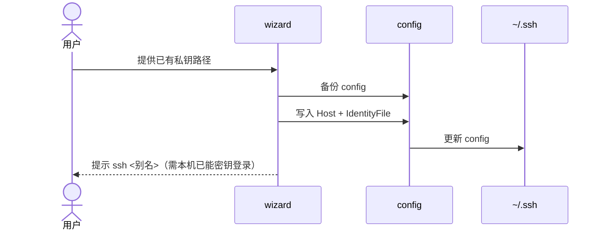
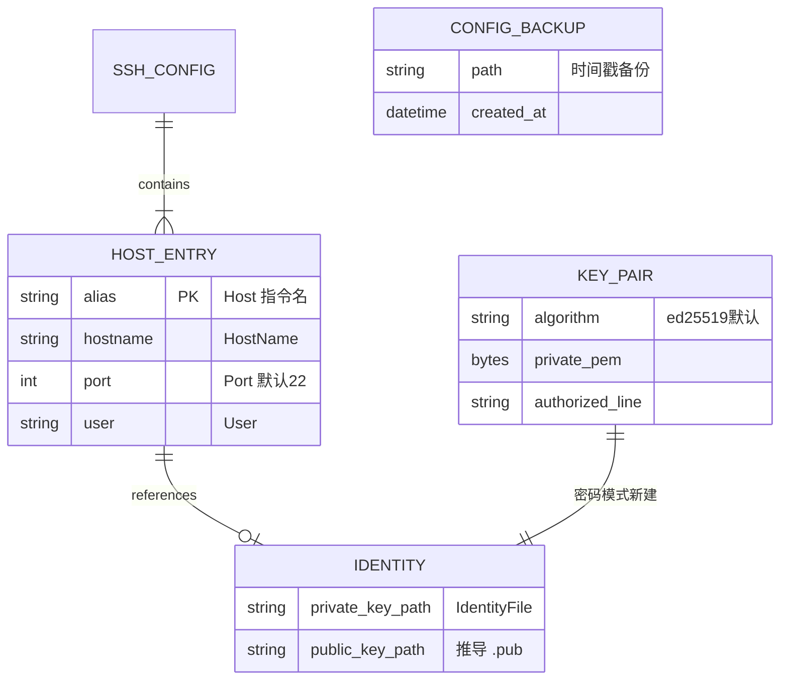

# fuckssh 系统架构设计

## 文档信息

- 版本：v1.0
- 日期：2026-05-22
- 基于：[PRD](./fuckssh-PRD.md) | [技术选型](./fuckssh-技术选型.md)

---

## 1. 架构概述

### 1.1 架构风格与决策理由

**推荐：模块化单体 CLI（Modular Monolith CLI）**

| 决策 | 选择 | 理由 |
|------|------|------|
| 部署形态 | 单二进制、无服务端 | PRD 明确仅操作本机 `~/.ssh`，无 QPS/并发需求 |
| 进程模型 | 单次命令、同步执行 | 向导与列表均为短时任务，无需常驻进程 |
| 数据存储 | 文件系统（OpenSSH 标准文件） | 与 Tabby、VS Code、`ssh` 互通；换机未装 fuckssh 仍可用 |
| 外部通信 | 仅密码模式向导时连远端 VPS | 无 HTTP API、无数据库、无消息队列 |

**不采用**：微服务、Serverless、嵌入式数据库、自有配置格式——均与 PRD「标准 SSH 生态唯一数据源」冲突，且单人项目复杂度不匹配。

### 1.2 系统上下文图



### 1.3 技术栈总览

| 层次 | 技术 | 说明 |
|------|------|------|
| 语言 | Go 1.22+ | 交叉编译、单二进制 |
| CLI | Cobra | `add` / `list` / `search` 及 V2 子命令 |
| 交互 | huh（首选）或 survey | 向导表单；列表用 tabwriter |
| 密钥 | `crypto/ed25519` + `x/crypto/ssh` | OpenSSH 格式 marshal，默认 Ed25519 |
| 远端部署 | `golang.org/x/crypto/ssh` | 密码模式写 `authorized_keys` |
| 配置 | 自研受限解析器 | MVP 明确支持范围 |
| 系统依赖 | `ssh` 可执行文件 | 检测 + 分平台安装指引 |
| 测试 | `go test` + testdata 夹具 | 表驱动；集成测试可选 |
| 发布 | GoReleaser + GitHub Releases | MVP 稳定后 |

---

## 2. 模块设计

### 2.1 模块总览



### 2.2 各模块详细设计

#### 2.2.1 `internal/cmd` — CLI 入口与路由

| 项 | 内容 |
|----|------|
| **职责** | 定义 Cobra 子命令、全局 flags（如 `--config` 覆盖路径）、绑定 handler |
| **边界** | 不含业务逻辑；不直接解析 config 或生成密钥 |
| **依赖** | `wizard`、`config`、`keys`、`sshclient` |
| **对外接口** | 子命令：`add`、`list`、`search`；V2：`backup`、`restore` |

#### 2.2.2 `internal/wizard` — 交互向导编排

| 项 | 内容 |
|----|------|
| **职责** | 密码/密钥两种模式的表单流程、默认值、校验、调用下游服务的事务编排 |
| **边界** | 不实现 config 解析细节、不实现 SSH 协议细节 |
| **依赖** | `config`、`keys`、`sshclient`、huh/survey |
| **关键流程** | 收集输入 → 备份 config → 生成/引用密钥 → 写 config →（密码模式）部署公钥 → 输出 `ssh <别名>` 提示 |

#### 2.2.3 `internal/config` — ssh config 读写与解析

| 项 | 内容 |
|----|------|
| **职责** | 解析 `Host` 块为结构化记录；追加/更新 Host 条目；list/search 数据源；修改前备份 |
| **边界** | MVP 不解析复杂 `Match`、不合并全局 `Host *` 策略；不修改远端 |
| **依赖** | `platform`（路径解析） |
| **MVP 解析范围** | 逐块 `Host`；字段：`HostName`、`User`、`Port`、`IdentityFile`；单行 `Include` 可记录为「未展开」提示 |
| **写入策略** | 追加到文件末尾或更新同名 Host 块（实现时二选一并文档化） |

#### 2.2.4 `internal/keys` — 密钥生成与落盘

| 项 | 内容 |
|----|------|
| **职责** | Ed25519（默认）/ 可选 RSA；`MarshalPrivateKey` / `MarshalAuthorizedKey`；写入 `~/.ssh/`；Unix `0600`、Windows ACL |
| **边界** | 不执行 SSH 连接；密钥连接模式仅返回路径供 config 引用 |
| **依赖** | `platform` |
| **命名** | 默认 `id_ed25519_fuckssh_<alias>` 或基于 Host 别名（实现阶段定一种规则并测试） |

#### 2.2.5 `internal/sshclient` — 系统 ssh 检测与远端部署

| 项 | 内容 |
|----|------|
| **职责** | `exec.LookPath("ssh")`；分平台安装指引文案；密码模式 SSH 客户端登录并 append `authorized_keys` |
| **边界** | 日常 `ssh <别名>` 由用户调用系统 ssh，本模块不包装长期连接 |
| **依赖** | `platform`（Windows 指引分支） |
| **失败处理** | 连接超时、认证失败、权限不足 → 结构化错误 + 是否已写 config/密钥的回滚提示 |

#### 2.2.6 `internal/platform` — 跨平台差异

| 项 | 内容 |
|----|------|
| **职责** | 解析 `~/.ssh` 真实路径（`USERPROFILE` vs `HOME`）；文件权限；OpenSSH 安装指引常量 |
| **边界** | 不含业务规则 |
| **依赖** | 仅标准库 + `os/user` |

#### 2.2.7 V2 预留：`internal/backup`（或合入 `config`）

| 项 | 内容 |
|----|------|
| **职责** | 加密打包 config + 选定私钥；恢复与 Host 冲突合并（同名不同 IP → 自动重命名） |
| **边界** | 不托管云存储；路径由用户 flag 指定 |
| **依赖** | 用户口令 + AEAD（如 argon2 + secretbox，实现阶段选型） |

### 2.3 模块依赖规则

- **禁止**：`config` → `wizard`（下层不依赖编排层）
- **允许**：`cmd` → 任意 domain；domain → `platform` only
- **测试**：`config`、`keys` 必须可无 CLI 框架单测

---

## 3. 数据流设计

### 3.1 核心业务流程

#### 流程 A：密码连接一站式配置（MVP P0）



#### 流程 B：密钥连接（MVP P0）



#### 流程 C：列出 / 搜索（MVP P0）

```mermaid
flowchart LR
    A[fuckssh list/search] --> B[config.Parse]
    B --> C{解析成功?}
    C -->|否| D[stderr: 行号+片段]
    C -->|是| E[[]HostEntry]
    E --> F{search?}
    F -->|是| G[子串匹配 alias/hostname/IP]
    F -->|否| H[tabwriter 输出]
    G --> H
```

### 3.2 状态管理

| 状态类型 | 策略 |
|----------|------|
| 运行时状态 | 无持久化；单次命令结束即释放 |
| 用户配置数据 | 仅存于 `~/.ssh/config` 与密钥文件 |
| 向导中的密码 | 仅驻内存，不写磁盘、不进日志 |
| 并发 | 不锁文件；文档约定「勿并行运行两个 add」；V2 可考虑写前 flock |

### 3.3 异步处理

**不适用。** 全流程同步；无队列、无后台 worker。

---

## 4. CLI 命令契约（替代 HTTP API）

本产品无 REST API；对外契约为 **Cobra 子命令 + flags**。

### 4.1 命令规范

| 约定 | 说明 |
|------|------|
| 命名 | 动词：`add`、`list`、`search`；V2：`backup`、`restore` |
| 全局 flag | `--config <path>` 覆盖默认 ssh config 路径（高级用户） |
| 输出 | 正常结果 → stdout；错误与指引 → stderr；退出码非 0 表示失败 |
| 帮助 | 每子命令 `--help`；root 列出子命令树 |

### 4.2 核心命令

| 命令 | 说明 | 关键参数 / 交互 |
|------|------|-----------------|
| `fuckssh add` | 新 VPS 向导 | 交互：模式、IP、用户、密码（密码模式）、端口、别名、算法 |
| `fuckssh list` | 列出所有 Host | 可选 `--json`（V2+ 可考虑） |
| `fuckssh search <query>` | 模糊搜索 | query 匹配 alias / HostName / IP |
| `fuckssh backup` | V2 加密导出 | `--out`、口令 |
| `fuckssh restore` | V2 解密合并 | `--from`、口令 |

### 4.3 「认证与授权」

**不适用（无多用户服务）。** 安全边界为本机 OS 用户权限：谁可读写 `~/.ssh` 谁就能使用本工具。

### 4.4 错误处理规范

| 类型 | 用户可见 | 退出码 |
|------|----------|--------|
| 用户输入无效 | 字段级中文说明 | 1 |
| 解析 config 失败 | 文件名、行号、片段 | 2 |
| 密钥/文件 IO 失败 | 路径 + 权限提示 | 3 |
| 远端部署失败 | 原因 + 已备份 config 路径 | 4 |
| 未检测到 ssh（`add`） | stderr 警告 + 分平台安装指引，**终止** | 5 |

错误类型用 `errors.Is` / 自定义 `ErrKind` 区分，CLI 层映射为文案与退出码。

---

## 5. 领域与文件模型

### 5.1 概念模型（非数据库 ER）



### 5.2 核心实体（内存结构）

```go
// 示意 — 实现时置于 internal/config
type HostEntry struct {
    Alias      string   // Host 名，可多个别名
    HostName   string
    User       string
    Port       int
    IdentityFile string
    SourceFile string   // 来自主 config 或 Include（MVP 可省略）
    LineStart  int      // 解析错误定位
}
```

### 5.3 索引策略

**不适用数据库索引。** 搜索为内存中对 ≤60 条记录的 O(n) 子串匹配，满足 PRD &lt;1s。

### 5.4 数据存储策略

| 数据 | 存储位置 | 格式 |
|------|----------|------|
| 连接配置 | `~/.ssh/config` | OpenSSH config 语法 |
| 私钥 | `~/.ssh/id_*` | OpenSSH PEM |
| 公钥 | `~/.ssh/*.pub` | `authorized_keys` 行格式 |
| 修改前备份 | `~/.ssh/config.fuckssh.bak.<timestamp>` | 原文件拷贝 |
| V2 备份包 | 用户指定目录 | 加密归档（自定义 manifest） |
| 界面语言（工具偏好） | `~/.config/fuckssh/settings.json`（Win: `%APPDATA%\fuckssh\`） | JSON `{"lang":"zh"\|"en"}`；首次交互运行选择，可用 `FUCKSSH_LANG` 覆盖 |

---

## 6. 部署架构

### 6.1 环境规划

| 环境 | 用途 |
|------|------|
| dev | 开发者本机 `go run` / `go build` |
| CI | GitHub Actions：`go test`、`golangci-lint` |
| release | GoReleaser 打 tag 发布到 GitHub Releases |

无 staging/prod 服务端。

### 6.2 构建与分发


| 平台 | 产物 | 说明 |
|------|------|------|
| Windows | `fuckssh.exe` | 需文档强调 OpenSSH 客户端可选功能 |
| macOS | `fuckssh` amd64/arm64 | 通常已有 ssh |
| Linux | `fuckssh` | 依赖 `openssh-client` |

### 6.3 网络拓扑

**不适用。** 仅发布时 GitHub HTTPS；运行时除向导连 VPS 外无服务间调用。

### 6.4 CI/CD 流水线

```yaml
# 概念阶段 — 实现脚手架时落地
on: [push, pull_request]
jobs:
  test:
    runs-on: ubuntu-latest
    steps:
      - uses: actions/checkout@v4
      - uses: actions/setup-go@v5
      - run: go test ./...
      - run: golangci-lint run   # 可选
```

发布：`tag v*` 触发 GoReleaser，附 changelog。

### 6.5 成本估算

| 项 | 月成本 |
|----|--------|
| 托管 | $0 |
| CI | $0（GitHub 免费档） |
| 域名 | $0（可选） |

---

## 7. 安全设计

### 7.1 认证鉴权

- 本机：依赖 OS 用户对 `~/.ssh` 的访问控制。
- 远端（密码模式）：一次性密码认证，仅用于首次部署公钥；**禁止**将密码写入 config、日志或备份包。

### 7.2 数据保护

| 项 | 措施 |
|----|------|
| 私钥文件 | Unix `0600`；Windows 限制继承 ACL（`platform` 封装） |
| 密码 | 内存持有，函数返回前清零引用（best effort） |
| config 修改 | 先备份再写；失败时文档说明手动恢复 |
| V2 备份 | 用户口令 + AEAD；manifest 不含明文密码；README 安全提示 |

### 7.3 安全策略

| 威胁 | 缓解 |
|------|------|
| 命令注入 | 不使用 shell 拼接；`ssh` 若调用用 `exec.Command` + 参数列表 |
| 路径遍历 | 用户提供的私钥路径需 `filepath.Clean` 并限制在预期目录（可选警告） |
| 备份包泄露（V2） | 强 KDF + 随机 salt；文档提醒同步盘风险 |
| 日志泄密 | 默认不打印密码、私钥内容；`--verbose` 仍屏蔽敏感字段 |

---

## 8. 可观测性

### 8.1 日志规范

| 级别 | 用途 | 输出 |
|------|------|------|
| 默认 | `list`/`search` 表格；`add` 成功时 stdout 仅 `ssh <别名>` 一行 | stdout |
| 进度与摘要 | 向导步骤、`add` 操作清单与安全提示 | stderr |
| 元信息 | `list`/`search` 的 config 路径与主机计数 | stderr |
| 错误 | 用户可读文案（随语言设置中/英）+ 技术细节（无密钥） | stderr |
| `--verbose` | 步骤级进度（解析块数、连接阶段） | stderr |

**不引入** ELK / Prometheus；可选未来 `FUCKSSH_DEBUG=1` 环境变量。

### 8.2 监控指标

**不适用。** 质量靠单元测试 + 发布前 Win/macOS 手工冒烟。

### 8.3 告警策略

**不适用。** 用户反馈走 GitHub Issues。

### 8.4 链路追踪

**不适用。**

---

## 9. 异常与容错

### 9.1 错误处理策略

- 领域错误包装 `fmt.Errorf("...: %w", err)`，CLI 层统一 `main` 处理退出码。
- 解析错误必须带 **行号** 与 **原始行片段**。
- 用户中断（Ctrl+C）：context 取消；已写文件则提示备份位置。

### 9.2 降级与熔断

**不适用微服务熔断。** 局部降级示例：

| 场景 | 行为 |
|------|------|
| 未安装 ssh | 完成 config + 密钥 + 远端部署，提示安装后再验收 |
| 解析到不支持的 Include | 列表标注「部分 Host 未加载」，不崩溃 |

### 9.3 重试与幂等

| 操作 | 策略 |
|------|------|
| 远端写 authorized_keys | 可选 1～2 次重试（网络抖动） |
| 重复 `add` 同别名 | 检测已存在 → 询问覆盖或中止（向导层） |
| 幂等 | 密钥连接模式重复写入相同块视为无害；密码模式重复生成密钥应避免（检测别名） |

### 9.4 数据一致性

- **强一致**：单次命令内「备份 → 写 config → 部署」顺序执行；部署失败则提示用户用备份恢复，不自动删密钥（避免丢数据）。
- **最终一致**：不适用分布式场景。

---

## 10. 关键决策记录（ADR 摘要）

| # | 决策 | 理由 | 状态 |
|---|------|------|------|
| ADR-1 | 模块化单体 CLI，无服务端 | 匹配 PRD 与单人维护成本 | 已采纳 |
| ADR-2 | Go 生成密钥，不依赖 ssh-keygen | 技术选型访谈结论；需 OpenSSH marshal API | 已采纳 |
| ADR-3 | 密码部署用 x/crypto/ssh | 无 ssh 也可完成部署；与系统 ssh 验收分离 | 已采纳 |
| ADR-4 | 自研受限 config 解析 | 控制 MVP 范围；Include/通配符渐进增强 | 已采纳 |
| ADR-5 | 实现顺序：list/search → 检测 → keys → add | 先只读后写入，降低学习曲线 | 已采纳 |
| ADR-6 | 修改 config 前自动备份 | PRD 安全要求 | 已采纳 |
| ADR-7 | MVP 不做编辑/删除/JumpHost | PRD 边界 | 已采纳 |
| ADR-8 | CLI 契约替代 REST API | 产品形态 | 已采纳 |

---

## 11. 目录结构与包边界

与技术选型对齐，定稿如下：

```
fuckssh/
├── cmd/fuckssh/main.go
├── internal/
│   ├── cmd/          # Cobra：add, list, search
│   ├── wizard/       # 向导编排
│   ├── config/       # 解析、写入、备份
│   ├── keys/         # 密钥生成
│   ├── sshclient/    # 检测 ssh、远端部署
│   └── platform/     # 路径与权限
├── testdata/         # 样例 config
├── docs/
├── go.mod
└── .goreleaser.yaml  # 发布后添加
```

---

## 12. 下一步

1. **确认本架构文档**（模块划分、流程、CLI 契约、错误码）。
2. 使用 **scaffold** skill 搭建 Go 项目脚手架（目录、`go mod`、Cobra 骨架）。
3. 使用 **dev-phase-planner** 制定 MVP 分阶段 TDD 开发计划。
4. 实现阶段在技术选型 §3.4 顺序上增加：**config 备份** 与 **解析范围** 的用户文档。

---

*文档结束*
