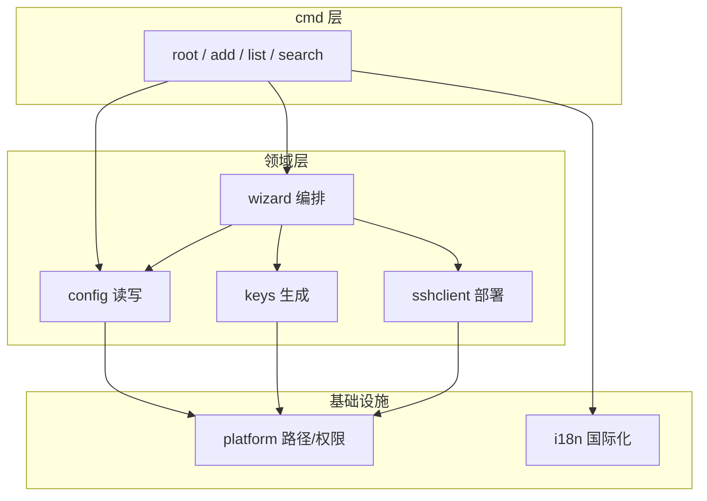

# fuckssh 代码审查报告

## 文档信息

| 项 | 内容 |
|----|------|
| 日期 | 2026-05-25 |
| 审查范围 | 全仓库代码（`cmd/`、`internal/*`、CI、工具链） |
| 审查视角 | 高级架构师 + 高级开发 |
| 结论 | **Request Changes** — 架构方向正确，MVP 可继续推进，但有几项应在下一迭代优先处理 |
| 测试状态 | `go test ./...` 全部通过 |

---

## 1. 总体评价

fuckssh 是一个结构清晰的**模块化 CLI 单体**，分层与 [系统架构设计](../fuckssh-架构设计.md) 基本一致：

- `internal/cmd` 保持薄层，仅负责 Cobra 路由与 I/O
- `internal/wizard` 负责交互编排
- `internal/config`、`internal/keys`、`internal/sshclient` 各司其职
- 表驱动测试与依赖注入（`passwordFlowDeps`、`dialSSH`、`checkSSHFn`）设计合理，适合初学者阅读

主要问题集中在：**两种 add 流程架构不对称**、**Cobra 反射 hack 脆弱**、**安全边界（Host Key）未落地**、**CI/工具链版本不一致**，以及约 30 处 lint 告警（含死代码）。

### 1.1 架构分层（现状）



### 1.2 模块评分

| 模块 | 评分 | 备注 |
|------|------|------|
| `internal/cmd` | B+ | 薄层合理；`add` 编排应再瘦身 |
| `internal/wizard` | B | 密码流完整；存在死代码；自定义 huh field 质量高 |
| `internal/config` | B+ | 解析器简单可靠；`Include` 是已知技术债 |
| `internal/keys` | A- | 职责单一，Ed25519 实现标准 |
| `internal/sshclient` | B | 部署逻辑健壮；Host key 校验是硬伤 |
| `internal/platform` | A- | 路径/权限封装干净 |
| `internal/i18n` | B | 框架设计好；部分错误文案未接入 |
| 测试 | B+ | 覆盖主路径；缺少真实 SSH 端到端 |

---

## 2. Critical — 应优先处理

### 2.1 SSH Host Key 校验缺失（MITM 风险）

**位置**：`internal/sshclient/deploy.go`

**问题**：密码模式部署公钥时使用 `ssh.InsecureIgnoreHostKey()`。首次连接 VPS 时，中间人攻击者可冒充目标主机，获取用户密码并写入错误公钥。代码与架构文档均标注为 MVP 待办，但尚未实现。

```go
HostKeyCallback: ssh.InsecureIgnoreHostKey(), //nolint:gosec // MVP：待加强 host key 校验
```

**影响**：安全 — 密码模式下的最高风险项。

**建议**：

- V1.1 实现 `known_hosts` 写入，或 `ssh-keyscan` + 用户确认指纹
- 至少提供 `--insecure` 显式 opt-in，默认拒绝未知 host key

---

### 2.2 add 流程架构不对称（维护成本高）

**位置**：`internal/cmd/add.go` vs `internal/wizard/password_mode.go`

**问题**：两种连接模式的编排位置不一致：

| 模式 | 编排位置 | 回滚 |
|------|----------|------|
| 密码模式 | `wizard/password_mode.go` 完整闭环 | ✅ 有 |
| 密钥模式 | `wizard` 收集输入 → `cmd/add.go` 执行 backup/stage/append | ✅ 有，但分散在两处 |

密钥模式的 backup → stageKey → appendHost 在 `add.go`，密码模式在 `wizard`。新增步骤（如 dry-run、并发锁、统一进度条）需要改两处，容易遗漏。

**影响**：可维护性 — 随功能增长维护成本线性上升。

**建议重构**（中等工作量，收益高）：

```go
// internal/wizard/add_flow.go（建议新增）
type AddOrchestrator struct {
    ConfigPath string
    Mode       ConnectionMode
}

func (o *AddOrchestrator) RunKey(ctx context.Context, result *WizardResult) (*WizardResult, error)
func (o *AddOrchestrator) RunPassword(ctx context.Context, input PasswordModeInput) (*WizardResult, error)
```

`cmd/add.go` 只负责：SSH 检测 → 调用 orchestrator → 打印成功信息。

---

### 2.3 Cobra 未导出字段的反射访问

**位置**：`internal/cmd/timing.go`

**问题**：通过 `reflect.ValueOf(root).Elem().FieldByName("args")` 读取 Cobra 内部未导出字段 `args`，用于 help 耗时统计与测试隔离。Cobra 版本升级可能静默破坏此逻辑。

**影响**：稳定性 — 依赖第三方库私有实现细节。

**建议**：在 `Execute()` 入口显式保存 `runArgs []string`；测试通过 `cmd.SetArgs` + 包级变量传递，完全去掉反射。

---

## 3. Improvements — 质量与可维护性

### 3.1 Go 版本不一致

**问题**：

| 来源 | 版本 |
|------|------|
| `go.mod` | `go 1.26.2` |
| `.github/workflows/ci.yml` | `go-version: "1.22"` |
| 架构文档 | Go 1.22+ |

**影响**：本地开发与 CI 行为可能不一致。

**建议**：CI 升级到与 `go.mod` 一致；或在 `go.mod` 明确最低支持版本并统一所有文档。

---

### 3.2 golangci-lint 32 项告警

**审查时状态**（`golangci-lint run ./...`）：

| 类型 | 数量 | 典型示例 |
|------|------|----------|
| errcheck | 14 | `defer Close()`、`fmt.Fprintf` 返回值未检查 |
| unused | 11 | `wizard/ui.go` 中 `connFeedback`、`keyModeResult` 等 |
| staticcheck | 4 | 类型推断冗余（`var x Type = val`） |
| gofmt | 3 | 格式问题（已局部修复） |

**涉及文件（errcheck 为主）**：

- `internal/cmd/add.go`
- `internal/config/backup.go`、`parse.go`、`restore.go`、`write.go`
- `internal/keys/copy.go`
- `internal/sshclient/deploy.go`
- `internal/wizard/progress.go`

**建议**：

- 对 `Close()` 使用命名返回值合并错误，或仅在 best-effort cleanup 处加 `//nolint:errcheck`
- 删除或明确标记 WIP 的死代码（见 §3.3）
- CI lint job 应作为 merge 门禁

---

### 3.3 死代码与未使用符号

**位置**：主要为 `internal/wizard/`

| 符号 | 文件 | 说明 |
|------|------|------|
| `skipCmdElapsed` | `internal/cmd/timing.go` | 已赋值但从未读取（**已修复**） |
| `connFeedback` 及方法 | `internal/wizard/ui.go` | 整块未引用 |
| `effectiveAliasForDisplay` | `internal/wizard/ui.go` | 未使用 |
| `formatTarget` | `internal/wizard/ui.go` | 未使用 |
| `keyModeResult` | `internal/wizard/key_mode.go` | 未使用 |
| `reportProgress` | `internal/wizard/progress.go` | 未使用（`reportProgressStep` 在用） |
| `inline` 字段 | `key_identity_field.go`、`password_test_field.go` | 结构体字段未读 |

**建议**：确认非 WIP 后删除；若为计划中的 UI 反馈，加 `// TODO:` 注释并关联 issue。

---

### 3.4 config 解析器能力边界未对用户充分暴露

**位置**：`internal/config/parse.go`

**问题**：

- `Include` 指令被**静默跳过**，不展开嵌套 config
- 不支持的配置项直接报错（`不支持的配置项`）

用户若使用复杂 config（含 `Include`、ProxyJump 等），`list`/`search` 可能漏主机或直接失败，且无明确提示。

**建议**：

- `list`/`search` 启动时检测 `Include` 并 stderr 警告
- V2 实现 Include 展开，或在文档/help 中明确 MVP 支持范围

---

### 3.5 并发写 config 无保护

**问题**：架构文档约定「勿并行运行两个 add」，但代码层无文件锁。两终端同时 `add` 可能导致 config 损坏或备份竞争。

**建议**：在 `AppendHost` / `Backup` 前对 config 文件加 advisory lock（如 `github.com/gofrs/flock` 或平台原生实现）。

---

### 3.6 密码内存清零效果有限

**位置**：`internal/wizard/password_mode.go` — `clearPassword()`

**问题**：Go 字符串不可变，`[]byte(*pw)` 会复制一份，原字符串仍可能在堆上残留。当前实现仅为 best-effort。

**建议**：保留现有做法即可，但文档/注释不宜过度宣传「安全清零」；可考虑用 `[]byte` 贯穿密码生命周期（改动较大，非必须）。

---

### 3.7 i18n 硬编码中文错误

**位置**：`internal/wizard/password_mode.go`（如 `finalizePasswordModeInput`）、`formatPasswordDeployError` 等

**问题**：部分错误信息直接写中文，未走 `i18n.T()`。英文用户会看到中英混杂输出。

**建议**：迁移到 `messages_zh.go` / `messages_en.go`，与现有 i18n 体系对齐。

---

### 3.8 测试覆盖缺口

**现状**：

- 有 integration test（`internal/cmd/add_test.go`）
- 无真实 SSH 端到端测试
- CI 仅在 ubuntu job 跑 `-race`，Windows/macOS matrix 未启用

**建议补充场景**：

- `Include` 指令存在时的 list/search 行为
- Host 块边界条件（空 Host、重复别名）
- 损坏 config 的 recovery
- 可选：Docker 内 SSH 服务器 E2E

---

### 3.9 调试日志泄露风险

**问题**：审查时发现 `internal/sshclient/debug-7c03c4.log`（未跟踪），含 host、user、port 等部署调试信息，不应进入仓库。

**已修复**：

- 删除该日志文件
- `.gitignore` 增加 `*.log`、`debug-*.log`

---

## 4. Nitpicks — 小改进

| # | 位置 | 问题 | 建议 |
|---|------|------|------|
| 1 | `internal/cmd/add.go` | `dirOf()` 手写路径解析 | 复用 `filepath.Dir` |
| 2 | `internal/wizard/ui.go` | `wizardTotalSteps = 7` 与注释「步骤 n/6」不一致 | 统一步数常量与文案 |
| 3 | `internal/cmd/list.go` | 静态未设 `Short`/`Long` | 靠 `applyLocalizedHelp` 动态填充，可接受；可加注释说明 |
| 4 | `go.mod` | huh/bubbletea 间接依赖链较长 | TUI 选型代价，无需改动；发布时注意二进制体积 |

---

## 5. 做得好的地方

1. **边界清晰**：OpenSSH 标准文件为唯一数据源，无过度抽象
2. **可测试性**：`passwordFlowDeps`、`dialSSH`、`checkSSHFn` 等注入点设计合理
3. **错误模型**：哨兵 error + `ExitCode` 映射与架构 §4.4 对齐
4. **回滚设计**：密码模式失败时 config + 密钥回滚逻辑完整
5. **权限意识**：`authorized_keys` 写前检查可写性、私钥 0600、目录 0700
6. **文档对齐**：PRD、技术选型、架构设计与代码模块划分高度一致

---

## 6. 建议演进路线

| 优先级 | 任务 | 理由 | 预估工作量 |
|--------|------|------|------------|
| **P0** | Host key 校验 | 安全 | 中 |
| **P0** | 统一 add orchestrator | 消除双路径维护成本 | 中 |
| **P1** | 去掉 Cobra 反射 | 稳定性 | 小 |
| **P1** | lint 清零 + 死代码清理 | CI 绿灯、代码卫生 | 小 |
| **P2** | config flock | 防并发损坏 | 小 |
| **P2** | Include 警告/支持 | 真实用户 config 兼容 | 中 |
| **P2** | i18n 补全硬编码文案 | 英文用户体验 | 小 |
| **V2** | backup/restore 命令 | 架构已预留 | 大 |

---

## 7. 审查时已做的小修复

以下改动已在工作区完成，**尚未 commit**：

| 改动 | 文件 |
|------|------|
| 删除含敏感调试信息的日志 | `internal/sshclient/debug-7c03c4.log` |
| 忽略日志文件 | `.gitignore` |
| 移除从未读取的 `skipCmdElapsed` | `internal/cmd/timing.go`、`internal/cmd/root.go` |
| 简化 staticcheck 告警 | `internal/config/search.go` |
| gofmt 格式化 | `internal/cmd/exitcode.go`、`list.go`、`localize.go` |

---

## 8. 相关文档

- [产品需求文档（PRD）](../fuckssh-PRD.md)
- [技术选型](../fuckssh-技术选型.md)
- [系统架构设计](../fuckssh-架构设计.md)
- [脚手架计划](../plans/fuckssh-scaffold-plan.md)
